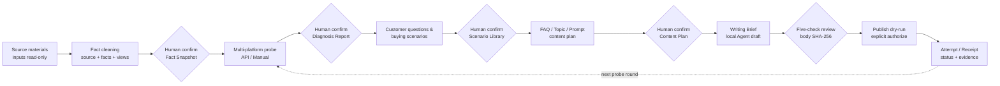

<div align="center">

# Buda GEO

### An open-source, local-first GEO workflow: turn business materials into auditable facts, then diagnose, plan, draft, review, and publish behind human gates

[](https://github.com/bindoon/buda-geo/actions/workflows/ci.yml)
[](https://nodejs.org/)
[](./LICENSE)
[](./CONTRIBUTING.md)

**Local-first · Evidence-first · Human-gated · MIT**

[中文](./README.md) · [English](./README.en.md)

[Quick start](#quick-start) · [Workflow](#workflow) · [Contribute](#contributing) · [Docs](#documentation)

</div>

---

## What it is

**Buda GEO** is an open-source toolchain for [GEO (Generative Engine Optimization)](./docs/方法论文章/). It turns Excel, Word, images, and business materials into **auditable company facts**, then runs phased AI visibility probes, customer-question / buying scenarios, content planning, article drafts, five-dimension human review, and **explicitly authorized** publish receipts.

It is not a black-box “batch article generator,” and it never treats `approved` as `published`. Each stage only consumes upstream confirmed versions and keeps sources, hashes, human decisions, and failure evidence—so you can self-host, deliver to clients, or fork and extend.

| You get | It deliberately does not |
|---|---|
| A local CLI + Agent Skill | Put customer secrets into JSON / Git |
| Validatable schemas, gates, and receipts | Skip human confirmation before external writes |
| Reproducible failures (timeout ≠ brand not mentioned) | Spray unrated site networks for volume |
| Per-project data contracts under `projects/{name}/` | Bind to one competitor’s proprietary export |

## Who it is for

- **In-house GEO teams** that want facts, diagnosis, topics, review, and publish to stay on their machines instead of handing full packs to a black-box SaaS.
- **Agencies / consultants** that need audit trails (snapshots, reports, review records, publish receipts), not untraceable generated drafts.
- **Developers** extending `openai-compatible` probes or publish `adapter`s—the contracts are reserved; PRs welcome.
- **Researchers / methodology readers** interested in evidence bases, micro-scenarios, and human gates—start with [`docs/方法论文章/`](./docs/方法论文章/) (Chinese methodology notes).

## Design principles

1. **Facts before content** — Articles may only use task-allowed public facts and local images; no free-form writing from the whole knowledge base.
2. **Real probes, no fake hits** — Supports OpenAI-compatible APIs and controlled manual ingest; timeouts / unavailability are not counted as “brand not mentioned.”
3. **A human gate at every stage** — Facts, diagnosis, scenarios, content plans, review, and external publish are confirmed separately.
4. **Clear local data boundaries** — Source `inputs/` are read-only; secrets live only in env vars / `.env` / `.secrets.env`.
5. **Open and extensible** — Runtime depends only on `geo-cli`, `buda-skills`, and the `projects/` directory contract; platform adapters can be community-contributed.

## Repository layout

```text
buda-geo/
├── packages/geo-cli/     # Node.js CLI (deterministic validation, state machine, probes, receipts)
├── skills/buda-skills/   # Agent Skill (semantic fill, stage routing, review entrypoints)
├── projects/             # Per-project workspaces (sample: 知鱼 / Zhiyu)
├── config/               # Probe-platform / publish-destination examples
└── docs/                 # Design & methodology (not a runtime dependency)
```

| Layer | Owns |
|---|---|
| `packages/geo-cli` | Discovery, table parsing, hashes, schemas, refs, safety checks, state machine, reports, receipts |
| `skills/buda-skills` | Stage routing, semantic fill, human review entrypoints, content-generation boundaries |
| `projects/{name}` | Isolated facts, strategy, articles, and publish audit trail |

Skill source of truth is only `skills/buda-skills`. `geo-cli skills install` prefers this GitHub repo; offline installs fall back to the npm bundled snapshot. Customer names live in `projects/registry.json`, never in Skill prose.

## Quick start

Requires Node.js 18+ and npm 9+.

```bash
git clone https://github.com/bindoon/buda-geo.git
cd buda-geo

npm --prefix packages/geo-cli ci
npm --prefix packages/geo-cli run build
npm --prefix packages/geo-cli link   # optional; or use node packages/geo-cli/dist/cli.js

geo-cli --help
geo-cli skills install
geo-cli skills status
geo-cli projects list
```

Configure probes as needed:

```bash
cp .env.example .env
cp config/probe-platforms.example.json config/probe-platforms.json
```

Put real keys only in `.env`. The CLI supports DeepSeek, Qwen, Doubao, and any OpenAI-compatible endpoint. JSON configs store environment variable **names**, never secret values.

```dotenv
BUDA_PROBE_CONFIG=./config/probe-platforms.json
DEEPSEEK_BASE_URL=https://api.deepseek.com/v1
DEEPSEEK_API_KEY=your-key
DEEPSEEK_MODEL=deepseek-chat
```

> `.env`, `.secrets.env`, and credential files are gitignored. Never put real secrets in Issues, logs, knowledge JSON, or publish receipts.

### Explore the in-repo sample

After clone, inspect confirmed artifacts under `projects/知鱼` (fact snapshot, diagnosis reports, scenario library, content plan):

```bash
geo-cli projects resolve "知鱼"
geo-cli status --project projects/知鱼
geo-cli diagnose validate --project projects/知鱼
geo-cli strategy validate --project projects/知鱼
geo-cli plan validate --project projects/知鱼
```

The sample is confirmed through the content-plan gate. Continue article bodies and full publish receipts on your own project with the end-to-end commands below.

### Create your own project

```text
projects/{name}/
├── inputs/          # Source materials (read-only; do not mutate originals)
├── knowledge/       # Cleaned facts and confirmation snapshots
├── diagnosis/       # Probes, evidence, reports
├── strategy/        # Scenario library and content plan
├── articles/        # Writing briefs, drafts, reviews
├── publish/         # Destinations, authorization, attempts, receipts
└── manifest.json    # app_id, gates, current status
```

Register the project in `projects/registry.json` (`dir` / `app_id` / `aliases`), then start from `inventory` → `clean`.

After npm publish you can also: `npm install -g @bindoon/geo-cli` (binary name remains `geo-cli`).

## Workflow



## Current capabilities

| Stage | Capability | Status |
|---|---|---|
| 1 | Inventory, structured cleaning, source index, fact ledger, business views, confirmation snapshot | Available |
| 2 | Diagnosis seed questions, OpenAI-compatible API probes, manual ingest, transparent metrics & limitations | Available |
| 3 | Customer questions, buying scenarios, evidence gaps, semantic-merge suggestions, priority review | Available |
| 4 | FAQ candidates, topics, prompt recipes, production tasks, quotas, human confirmation | Available |
| 5 | Fact/image allowlist writing briefs, Markdown ingest, revision & risk checks | Available |
| 6 | Five-check review (facts, boundary, channel, compliance, originality); approval bound to body hash | Available |
| 7 | Destination registry, dry-run, explicit authorize, manual attempt/receipt, idempotent validation | Available |
| 7+ | Concrete media / B2B / social / site auto-publish adapters | Contract reserved; implementations welcome |
| 8 | Re-run the same diagnosis flow after publish | Available; auto diff reports TBD |
| 9 | Cloud read-only sync & customer portal | Planned; local schemas already isolated by `app_id` |

Full command surface: [`packages/geo-cli/README.md`](./packages/geo-cli/README.md). Below is a local end-to-end sketch—replace `projects/your-project` with a real path; use IDs from the previous step.

<details>
<summary><strong>End-to-end command sketch (click to expand)</strong></summary>

### A. Fact cleaning & confirmation

```bash
geo-cli inventory --project projects/your-project
geo-cli clean --project projects/your-project
geo-cli validate --project projects/your-project
geo-cli review-clean --project projects/your-project
# After human review of clean-review.md
geo-cli confirm-clean --project projects/your-project
```

### B. AI visibility probes

```bash
geo-cli diagnose seed-draft --project projects/your-project --size 25
geo-cli diagnose seed-approve-non-risk --project projects/your-project
geo-cli diagnose seed-review --project projects/your-project \
  --question QUESTION_ID --action approve
geo-cli diagnose seed-confirm --project projects/your-project

geo-cli diagnose run-create --project projects/your-project \
  --seed-set SEED_SET_ID --platforms deepseek,qwen
geo-cli diagnose probe-run --project projects/your-project \
  --run RUN_ID --concurrency 2
# Without API: diagnose probe-ingest --input manual-probes.json

geo-cli diagnose report --project projects/your-project --run RUN_ID
geo-cli diagnose validate --project projects/your-project
geo-cli diagnose confirm --project projects/your-project --report REPORT_ID
```

Failures / timeouts / unavailability do not enter the “brand not mentioned” denominator. Retry failures, or use `--accept-limitations` only when the user explicitly accepts limits.

### C. Scenarios → plan → article → review → publish

```bash
geo-cli strategy generate --project projects/your-project
geo-cli strategy approve-ready --project projects/your-project
geo-cli strategy confirm --project projects/your-project

geo-cli plan generate --project projects/your-project --quota 30
geo-cli plan approve-ready --project projects/your-project
geo-cli plan confirm --project projects/your-project

geo-cli article prepare --project projects/your-project --limit 3
# Agent reads only the brief allowlist; embed assets/images/... relative paths
geo-cli article ingest --project projects/your-project \
  --article ARTICLE_ID --input draft.md --title "Title" --used-facts fact_x,fact_y
geo-cli article review-prepare --project projects/your-project
geo-cli article review-decide --project projects/your-project \
  --article ARTICLE_ID --action approve \
  --assessment assessment.json --reason "All five checks passed"

mkdir -p projects/your-project/publish
cp config/publishing-destinations.example.json \
  projects/your-project/publish/destinations.json
# Set app_id; enable only rated destinations; never store passwords/tokens

geo-cli publish prepare --project projects/your-project
geo-cli publish authorize --project projects/your-project \
  --plan PLAN_ID --confirm PLAN_ID --by "operator" --reason "Reviewed"
geo-cli publish record --project projects/your-project \
  --plan PLAN_ID --item ITEM_ID --status published \
  --by "operator" --external-url "https://example.com/article"
geo-cli publish validate --project projects/your-project
```

The current open-source release does not call unknown publish APIs. `adapter` only reserves env var names and a unified receipt contract. Real platform integrations must still consume explicit authorization and handle auth, rate limits, cost, moderation status, and idempotency themselves.

</details>

## Configuration

### Probe platforms

[`config/probe-platforms.example.json`](./config/probe-platforms.example.json) fields per platform: `id`, `adapter` (currently `openai-compatible`), `base_url_env` / `api_key_env` / `model_env`, `endpoint_path`, `timeout_ms`. Existing `question_id + platform` pairs in the same run are skipped; retry failed platforms with a new run.

### Publish destinations

[`config/publishing-destinations.example.json`](./config/publishing-destinations.example.json) supports:

- `manual`: publish by hand or via a paid platform, then `publish record` for evidence.
- `adapter`: future real-API config references; only `endpoint_env` / `token_env` names, never credential values.

Channels are only `social | media | b2b | site`.

## Security & privacy

- `inputs/` is read-only; do not overwrite customer originals.
- Passwords and tokens belong only in env vars, root `.env`, or project `.secrets.env`.
- Legal-person ID cards are for platform enterprise KYC only—never copy, OCR, or put into JSON / assets / articles.
- Business licenses, trademark certificates, permits, and registration packs stay in raw `inputs/`.
- Only confirmed facts with `disclosure_level=public` may enter public articles.
- Report security issues privately via [SECURITY.md](./SECURITY.md); do not paste customer data into public Issues.

## Contributing

Issues, Discussions, and PRs are welcome. Please read [CONTRIBUTING.md](./CONTRIBUTING.md) first.

Especially welcome:

- New OpenAI-compatible probe platform configs and docs
- Publish `adapter`s (auth, rate limits, cost, idempotency, moderation status, error mapping, receipts)
- Schema / validation / failure-path tests
- English docs, desensitized samples, accessibility, and DX improvements
- Diagnosis diff reports, site audit, and related capabilities

Local tests:

```bash
npm --prefix packages/geo-cli test
```

## Documentation

- [Chinese README](./README.md) — primary project intro (中文)
- [geo-cli command reference](./packages/geo-cli/README.md) — full command surface, Skill distribution, design boundaries
- [buda-skills](./skills/buda-skills/SKILL.md) — Agent router and staged references
- [Detailed solution (Chinese)](./docs/布达-GEO工具详细解决方案.md) — directory contracts, acceptance, local/cloud boundary
- [Methodology notes (Chinese)](./docs/方法论文章/) — evidence base, micro-scenarios, GEO SOP
- [Platform research notes (Chinese)](./docs/各GEO平台资料/) — R&D benchmarking only; **not** a runtime dependency or a place to submit customer data

## License

[MIT](./LICENSE) © Buda GEO contributors.
