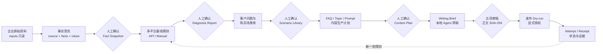

<div align="center">

# Buda GEO

### 把企业资料变成可追溯事实，把 GEO 从“批量写文”变成可验证、可复盘的工程流程

[](https://github.com/bindoon/buda-geo/actions/workflows/ci.yml)
[](https://nodejs.org/)
[](./LICENSE)
[](#为什么是-buda-geo)

**Local-first · Evidence-first · Human-gated · SaaS-ready**

</div>

---

Buda GEO 是一套面向企业 GEO（Generative Engine Optimization）的开源本地工作流。它把 Excel、Word、图片和业务资料整理为可审计的企业事实，再依次完成 AI 可见度探测、客户问题与购买场景、内容规划、文章生成、五项人工审稿，以及显式授权的发布回执。

它不把“生成了很多文章”当作完成，也不把 `approved` 当作 `published`。每个阶段都消费上游的已确认版本，并保留来源、哈希、人工决策和失败证据。

## 为什么是 Buda GEO

- **事实先于内容**：文章只能读取任务允许的公开事实和本地图片，不允许从整份知识库自由发挥。
- **真实探测，不伪造命中**：支持 OpenAI-compatible 平台 API 和受控人工录入；超时、不可用与失败不会被算作“品牌未提及”。
- **每一步都有人类闸门**：事实、诊断题、场景、内容计划、文章审稿和外部发布分别确认。
- **本地数据边界清晰**：客户原始资料留在 `projects/{项目}/inputs/`，密钥只在环境变量、根 `.env` 或项目 `.secrets.env`。
- **为 SaaS 留好结构，不维护两套逻辑**：一期本地生产；未来云端只需同步已确认产物，数据模型已经按项目和 `app_id` 隔离。

## 工作流



## 当前能力

| 阶段 | 能力 | 状态 |
|---|---|---|
| 1 | 原件 inventory、结构化清洗、来源索引、事实底账、业务视图、确认快照 | 可用 |
| 2 | 诊断种子题、OpenAI-compatible API 探测、人工录入、透明指标与限制说明 | 可用 |
| 3 | 客户问题、购买场景、证据缺口、语义合并建议、优先级复核 | 可用 |
| 4 | FAQ candidate、Topic、Prompt recipe、生产任务、配额与人工确认 | 可用 |
| 5 | 事实/图片 allowlist writing brief、Markdown ingest、revision 与风险检查 | 可用 |
| 6 | 事实、边界、渠道、合规、原创性五项审稿；批准绑定正文哈希 | 可用 |
| 7 | Destination registry、dry-run、显式授权、manual attempt/receipt、幂等校验 | 可用 |
| 7+ | 具体媒体/B2B/自媒体/官网自动发布 adapter | 契约已预留，需按平台实现 |
| 8 | 发布后重新运行同一诊断流程 | 可用；自动差异报告待完善 |
| 9 | SaaS 只读同步与客户门户 | Part B，未实现 |

## 5 分钟启动

### 1. 安装

要求：Node.js 18+、npm 9+。

```bash
git clone https://github.com/bindoon/buda-geo.git
cd buda-geo

npm --prefix packages/geo-cli ci
npm --prefix packages/geo-cli run build
npm --prefix packages/geo-cli link

geo-cli --help
```

不想全局 link 时，所有命令都可以改为：

```bash
node packages/geo-cli/dist/cli.js <command>
```

### 2. 配置本地环境

```bash
cp .env.example .env
cp config/probe-platforms.example.json config/probe-platforms.json
```

在 `.env` 中只填写你实际使用的平台。CLI 支持 DeepSeek、通义千问、豆包及任意 OpenAI-compatible 接口；平台清单在 `config/probe-platforms.json` 中配置，密钥值永远不进入 JSON 产物。

```dotenv
BUDA_PROBE_CONFIG=./config/probe-platforms.json

DEEPSEEK_BASE_URL=https://api.deepseek.com/v1
DEEPSEEK_API_KEY=your-key
DEEPSEEK_MODEL=deepseek-chat
```

> `.env`、`.secrets.env`、凭证文件已被 Git 忽略。不要把真实密钥提交到 Issue、日志、知识库或发布回执。

### 3. 选择或创建项目

```bash
geo-cli projects list
geo-cli projects resolve "晶铭"
```

新项目目录必须是：

```text
projects/{项目名}/
├── inputs/                 # 原始资料，只读
├── knowledge/              # 清洗事实与确认快照
├── diagnosis/              # 探测、证据、报告与缺口
├── strategy/               # 场景库与内容计划
├── articles/               # writing brief、草稿、审稿记录
├── publish/                # 目标、计划、授权、attempt、receipt
└── manifest.json           # app_id、闸门与当前状态
```

把项目登记到 `projects/registry.json`。原始资料只放 `inputs/`；CLI 不会修改它们。

## 完整本地链路

下面使用 `projects/晶铭服饰` 展示命令顺序。带 ID 的命令请使用前一步输出的真实 ID；人工确认不是可跳过的自动步骤。

### A. 企业事实清洗与确认

```bash
geo-cli inventory --project projects/晶铭服饰
geo-cli clean --project projects/晶铭服饰
geo-cli validate --project projects/晶铭服饰
geo-cli review-clean --project projects/晶铭服饰

# 人工复核 clean-review.md 后
geo-cli confirm-clean --project projects/晶铭服饰
```

产物包括 `source-index.json`、`company.facts.json`、`company.baseinfo.json`、`company.profile.json`、`company.skus.json` 和不可变 fact snapshot。

### B. AI 可见度与推荐情况探测

```bash
geo-cli diagnose seed-draft --project projects/晶铭服饰 --size 25
geo-cli diagnose seed-approve-non-risk --project projects/晶铭服饰

# 负面风险题必须逐题 approve / reject / replace
geo-cli diagnose seed-review --project projects/晶铭服饰 \
  --question QUESTION_ID --action approve
geo-cli diagnose seed-confirm --project projects/晶铭服饰

geo-cli diagnose run-create --project projects/晶铭服饰 \
  --seed-set SEED_SET_ID --platforms deepseek,qwen
```

调用已配置 API：

```bash
geo-cli diagnose probe-run --project projects/晶铭服饰 \
  --run RUN_ID --concurrency 2
```

没有正式 API、需要登录态或需要人工核对时，使用受控录入：

```bash
geo-cli diagnose probe-ingest --project projects/晶铭服饰 \
  --run RUN_ID --input manual-probes.json
```

生成并确认报告：

```bash
geo-cli diagnose report --project projects/晶铭服饰 --run RUN_ID
geo-cli diagnose validate --project projects/晶铭服饰
geo-cli diagnose confirm --project projects/晶铭服饰 --report REPORT_ID
```

如果仍有失败项，必须重试；只有用户明确接受限制时才使用 `--accept-limitations`。失败/超时/不可用不进入品牌未提及分母。

### C. 客户问题与购买场景

```bash
geo-cli strategy import-legacy --project projects/晶铭服饰 \
  --input projects/晶铭服饰/inputs/晶铭服饰关键词.xlsx
geo-cli strategy generate --project projects/晶铭服饰
geo-cli strategy approve-ready --project projects/晶铭服饰
geo-cli strategy validate --project projects/晶铭服饰
geo-cli strategy confirm --project projects/晶铭服饰
```

High evidence gap、语义合并建议和非就绪场景必须通过 `gap-review`、`merge-review` 或逐项 `review` 处理。

### D. 内容规划

```bash
geo-cli plan generate --project projects/晶铭服饰 --quota 30
geo-cli plan approve-ready --project projects/晶铭服饰
geo-cli plan validate --project projects/晶铭服饰
geo-cli plan confirm --project projects/晶铭服饰
```

普通用户复核入口是 `strategy/content-plan-review.md`。只有 confirmed plan 中已批准的 `ready | research_only` 任务能进入文章生成。

### E. 文章生成与五项审稿

```bash
geo-cli article prepare --project projects/晶铭服饰 --limit 3
```

本地 Agent 只读取 `articles/work/{article_id}.brief.json` 和对应 prompt，正文使用允许的 Fact IDs，并以相对路径嵌入 `assets/images/...`。完成后：

```bash
geo-cli article ingest --project projects/晶铭服饰 \
  --article ARTICLE_ID --input draft.md --title "文章标题" \
  --used-facts fact_x,fact_y

geo-cli article review-prepare --project projects/晶铭服饰
geo-cli article review-decide --project projects/晶铭服饰 \
  --article ARTICLE_ID --action approve \
  --assessment assessment.json --reason "五项检查通过"
geo-cli article review-validate --project projects/晶铭服饰
```

`ingest` 永远只创建 `draft + requires_human_review`。Revision 会改变正文哈希，并自动让旧批准失效。

### F. 发布准备、授权与回执

```bash
mkdir -p projects/晶铭服饰/publish
cp config/publishing-destinations.example.json \
  projects/晶铭服饰/publish/destinations.json
```

先把 destination registry 的 `app_id` 改为项目真实值，只启用真实、已评级的目标。不要在该文件中写密码或 Token。

```bash
geo-cli publish prepare --project projects/晶铭服饰

# 人工复核 publish/plan-review.md 后，必须准确回显 PLAN_ID
geo-cli publish authorize --project projects/晶铭服饰 \
  --plan PLAN_ID --confirm PLAN_ID --by "操作人" \
  --reason "已核对文章、目标、费用和账号权限"

# 人工或付费平台提交后记录真实状态
geo-cli publish record --project projects/晶铭服饰 \
  --plan PLAN_ID --item ITEM_ID --status submitted \
  --by "操作人" --external-id "平台任务号"

geo-cli publish record --project projects/晶铭服饰 \
  --plan PLAN_ID --item ITEM_ID --status published \
  --by "操作人" --external-url "https://example.com/article"

geo-cli publish status --project projects/晶铭服饰 --plan PLAN_ID
geo-cli publish validate --project projects/晶铭服饰
```

当前开源版本不会调用未知发布 API。`adapter` 目标只预留环境变量和统一回执契约；接入具体平台时仍必须消费显式授权，并单独处理认证、限流、费用、审核状态和幂等请求。

## 配置说明

### 探测平台

[`config/probe-platforms.example.json`](./config/probe-platforms.example.json) 每个平台包含：

| 字段 | 说明 |
|---|---|
| `id` | `run-create --platforms` 使用的稳定平台 ID |
| `adapter` | 当前支持 `openai-compatible` |
| `base_url_env` | Base URL 的环境变量名 |
| `api_key_env` | API Key 的环境变量名，不是密钥值 |
| `model_env` | 模型/Endpoint ID 的环境变量名 |
| `endpoint_path` | 默认 `/chat/completions` |
| `timeout_ms` | 单次调用超时 |

同一 run 中已经存在的 `question_id + platform` 会跳过，避免重复计数。需要重试失败平台时，建议新建 run。

### 发布目标

[`config/publishing-destinations.example.json`](./config/publishing-destinations.example.json) 支持：

- `manual`：运营人工发布或通过付费平台投放，然后用 `publish record` 留证。
- `adapter`：未来真实 API 的配置引用；registry 只能写 `endpoint_env` / `token_env`，不能写凭证值。

发布 channel 只有 `social | media | b2b | site`。不要为了凑量向未评级站群发。

## CLI 与 Skill 的边界

| 层 | 负责什么 |
|---|---|
| `packages/geo-cli` | 文件发现、表解析、哈希、稳定 ID、Schema、引用、安全校验、状态机、报告和回执 |
| `skills/buda-skills` | 业务阶段路由、语义装填、人工复核入口、内容生成与风险边界 |
| `projects/{项目名}` | 客户隔离的数据、事实、策略、文章和发布审计 |

Cursor 入口：`.cursor/skills/buda-skills` → `skills/buda-skills/`。Skill 不包含客户名单；客户解析只读取 `projects/registry.json`。

## 安全与隐私

- `inputs/` 只读；不要覆盖客户原件。
- 密码、Token 只能进入环境变量、根 `.env` 或项目 `.secrets.env`。
- 法人身份证只用于平台企业实名，不复制、不 OCR、不进入 JSON、图片资产或文章。
- 营业执照、商标证、许可证和平台注册材料只保留在原始 `inputs/`。
- 只有 `disclosure_level=public` 且已确认的事实可进入公开文章。
- 发现安全问题请按 [SECURITY.md](./SECURITY.md) 私下报告，不要公开包含客户数据的 Issue。

## 开发与测试

```bash
npm --prefix packages/geo-cli test
```

测试覆盖清洗、稳定 ID、Schema/引用、敏感信息、诊断失败分母、场景闸门、内容计划、文章哈希审稿、API 适配器、发布授权、失败重试和终态防重。

贡献前请阅读 [CONTRIBUTING.md](./CONTRIBUTING.md)。

## 文档索引

- [布达 GEO 详细解决方案](./docs/布达-GEO工具详细解决方案.md) — 整体方法、目录契约、验收与 Part A/B 边界
- [工具开发任务拆分与报价方案](./docs/布达-工具开发任务拆分与报价方案.md) — 历史模块拆分与商业设计参考
- [geo-cli 文档](./packages/geo-cli/README.md) — 完整命令面与 CLI 设计边界
- [buda-skills](./skills/buda-skills/SKILL.md) — Agent 总路由与分阶段 reference
- [平台研究资料](./docs/各GEO平台资料/) — 仅用于研发对标，不是运行时依赖或客户数据提交目标
- [方法论文章](./docs/方法论文章/) — 工厂 GEO、证据库、微场景与通用 SOP

## License

[MIT](./LICENSE) © Buda GEO contributors.
