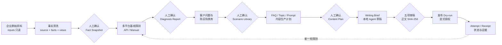

<div align="center">

# Buda GEO

### 开源的本地 GEO 工作流：把企业资料变成可追溯事实，再带着人工闸门做诊断、选题、写稿与授权发布

[](https://github.com/bindoon/buda-geo/actions/workflows/ci.yml)
[](https://nodejs.org/)
[](./LICENSE)
[](./CONTRIBUTING.md)

**Local-first · Evidence-first · Human-gated · MIT**

[中文](./README.md) · [English](./README.en.md)

[快速开始](#快速开始) · [工作流](#工作流) · [贡献](#参与贡献) · [文档](#文档索引)

</div>

---

## 这是什么

**Buda GEO** 是一套面向 [GEO（Generative Engine Optimization）](./docs/方法论文章/) 的开源工具链。它帮你把 Excel、Word、图片和业务资料整理成**可审计的企业事实**，再按阶段完成 AI 可见度探测、客户问题与购买场景、内容规划、文章草稿、五项人工审稿，以及**显式授权**后的发布回执。

它不是「一键批量写文」的黑盒，也不把 `approved` 当成 `published`。每个阶段只消费上游已确认版本，并保留来源、哈希、人工决策和失败证据——方便自用、交付，也方便社区 fork、扩展与复盘。

| 你得到的 | 它刻意不做的 |
|---|---|
| 本地可跑的 CLI + Agent Skill | 把客户密钥写进 JSON / Git |
| 可校验的 Schema、闸门与回执 | 跳过人工确认直接外发 |
| 失败可复现（超时 ≠ 品牌未提及） | 向未评级站群发凑量 |
| 按 `projects/{名}/` 隔离的数据契约 | 绑定某一家竞品平台的专用导出 |

## 适合谁

- **自己做 GEO 的团队**：想把事实、诊断、选题、审稿、发布留在本机，而不是把整包资料交给黑盒 SaaS。
- **代理商 / 顾问**：需要可复盘的交付物（快照、报告、审稿记录、发布回执），而不是一堆不可追溯的生成稿。
- **开发者**：想给 `openai-compatible` 探测或发布 `adapter` 做扩展；契约已预留，欢迎 PR。
- **研究者 / 方法论读者**：关心「证据库 + 微场景 + 人工闸门」，可先读 [`docs/方法论文章/`](./docs/方法论文章/)。

## 设计原则

1. **事实先于内容** — 文章只读任务允许的公开事实与本地配图，禁止从整份知识库自由发挥。
2. **真实探测，不伪造命中** — 支持 OpenAI-compatible API 与受控人工录入；超时、不可用不会被算进「品牌未提及」。
3. **每一步都有人类闸门** — 事实、诊断、场景、内容计划、审稿、外部发布分别确认。
4. **本地数据边界清晰** — 原件只读；密钥只在环境变量 / `.env` / `.secrets.env`。
5. **开源可扩展，不绑死实现** — 运行时只依赖 `geo-cli`、`buda-skills` 与 `projects/` 目录契约；平台 adapter 可社区贡献。

## 仓库结构

```text
buda-geo/
├── packages/geo-cli/     # Node.js CLI（确定性校验、状态机、探测与回执）
├── skills/buda-skills/   # Agent Skill（语义装填、阶段路由、复核入口）
├── projects/             # 按项目隔离的工作区（样板：知鱼）
├── config/               # 探测平台 / 发布目标示例配置
└── docs/                 # 方案与方法论（非运行时依赖）
```

| 层 | 负责 |
|---|---|
| `packages/geo-cli` | 文件发现、表解析、哈希、Schema、引用、安全校验、状态机、报告与回执 |
| `skills/buda-skills` | 业务阶段路由、语义装填、人工复核入口、内容生成边界 |
| `projects/{项目名}` | 客户隔离的事实、策略、文章与发布审计 |

Skill 源码只维护一份：`skills/buda-skills`。`geo-cli skills install` 优先从本仓库拉取；离线时用 npm 内置快照。客户名单在 `projects/registry.json`，不写进 Skill 正文。

## 快速开始

要求：Node.js 18+、npm 9+。

```bash
git clone https://github.com/bindoon/buda-geo.git
cd buda-geo

npm --prefix packages/geo-cli ci
npm --prefix packages/geo-cli run build
npm --prefix packages/geo-cli link   # 可选；也可用 node packages/geo-cli/dist/cli.js

geo-cli --help
geo-cli skills install
geo-cli skills status
geo-cli projects list
```

配置探测（按需）：

```bash
cp .env.example .env
cp config/probe-platforms.example.json config/probe-platforms.json
```

在 `.env` 里填写你实际使用的平台密钥。CLI 支持 DeepSeek、通义千问、豆包及任意 OpenAI-compatible 接口；JSON 里只写环境变量名，不写密钥值。

```dotenv
BUDA_PROBE_CONFIG=./config/probe-platforms.json
DEEPSEEK_BASE_URL=https://api.deepseek.com/v1
DEEPSEEK_API_KEY=your-key
DEEPSEEK_MODEL=deepseek-chat
```

> `.env`、`.secrets.env`、凭证文件已 gitignore。不要把真实密钥写进 Issue、日志、知识库或发布回执。

### 探索仓库内样板

克隆后可直接查看 `projects/知鱼` 的已确认产物（事实快照、诊断报告、场景库、内容计划、发布回执）：

```bash
geo-cli projects resolve "知鱼"
geo-cli status --project projects/知鱼
geo-cli diagnose validate --project projects/知鱼
geo-cli strategy validate --project projects/知鱼
geo-cli plan validate --project projects/知鱼
```

样板已走到内容计划确认；文章正文与完整发布回执可按下方端到端命令在自有项目中继续跑通。
### 新建自己的项目

```text
projects/{项目名}/
├── inputs/          # 原始资料（只读，不要改原件）
├── knowledge/       # 清洗事实与确认快照
├── diagnosis/       # 探测、证据、报告
├── strategy/        # 场景库与内容计划
├── articles/        # writing brief、草稿、审稿
├── publish/         # 目标、授权、attempt、receipt
└── manifest.json    # app_id、闸门与当前状态
```

把项目登记到 `projects/registry.json`（参考已有条目的 `dir` / `app_id` / `aliases`），然后从 `inventory` → `clean` 开始。

发布到 npm 后也可：`npm install -g @bindoon/geo-cli`（二进制名仍是 `geo-cli`）。

## 工作流


```mermaid
flowchart LR
    A["企业原始资料<br/>inputs 只读"] --> B["事实清洗<br/>source + facts + views"]
    B --> G1{"人工确认<br/>Fact Snapshot"}
    G1 --> C["多平台基线探测<br/>API / Manual"]
    C --> G2{"人工确认<br/>Diagnosis Report"}
    G2 --> D["客户问题与<br/>购买场景库"]
    D --> G3{"人工确认<br/>Scenario Library"}
    G3 --> E["FAQ / Topic / Prompt<br/>内容生产计划"]
    E --> G4{"人工确认<br/>Content Plan"}
    G4 --> F["Writing Brief<br/>本地 Agent 草稿"]
    F --> G5{"五项审稿<br/>正文 SHA-256"}
    G5 --> H["发布 Dry-run<br/>显式授权"]
    H --> I["Attempt / Receipt<br/>状态与证据"]
    I -.新一轮探测.-> C
```

## 当前能力

| 阶段 | 能力 | 状态 |
|---|---|---|
| 1 | 原件 inventory、结构化清洗、来源索引、事实底账、业务视图、确认快照 | 可用 |
| 2 | 诊断种子题、OpenAI-compatible API 探测、人工录入、透明指标与限制说明 | 可用 |
| 3 | 客户问题、购买场景、证据缺口、语义合并建议、优先级复核 | 可用 |
| 4 | FAQ candidate、Topic、Prompt recipe、生产任务、配额与人工确认 | 可用 |
| 5 | 事实/图片 allowlist writing brief、Markdown ingest、revision 与风险检查 | 可用 |
| 6 | 事实、边界、渠道、合规、原创性五项审稿；批准绑定正文哈希 | 可用 |
| 7 | Destination registry、dry-run、显式授权、manual attempt/receipt、幂等校验 | 可用 |
| 7+ | 具体媒体 / B2B / 自媒体 / 官网自动发布 adapter | 契约已预留，欢迎贡献实现 |
| 8 | 发布后重新运行同一诊断流程 | 可用；自动差异报告待完善 |
| 9 | 云端只读同步与客户门户 | 规划中，本地产物 Schema 已按 `app_id` 隔离 |

完整命令面见 [`packages/geo-cli/README.md`](./packages/geo-cli/README.md)。下面是一条可对照的本地链路（把 `projects/你的项目` 换成真实路径；带 ID 的参数用上一步输出）。

<details>
<summary><strong>端到端命令速览（点击展开）</strong></summary>

### A. 事实清洗与确认

```bash
geo-cli inventory --project projects/你的项目
geo-cli clean --project projects/你的项目
geo-cli validate --project projects/你的项目
geo-cli review-clean --project projects/你的项目
# 人工复核 clean-review.md 后
geo-cli confirm-clean --project projects/你的项目
```

### B. AI 可见度探测

```bash
geo-cli diagnose seed-draft --project projects/你的项目 --size 25
geo-cli diagnose seed-approve-non-risk --project projects/你的项目
geo-cli diagnose seed-review --project projects/你的项目 \
  --question QUESTION_ID --action approve
geo-cli diagnose seed-confirm --project projects/你的项目

geo-cli diagnose run-create --project projects/你的项目 \
  --seed-set SEED_SET_ID --platforms deepseek,qwen
geo-cli diagnose probe-run --project projects/你的项目 \
  --run RUN_ID --concurrency 2
# 无 API 时：diagnose probe-ingest --input manual-probes.json

geo-cli diagnose report --project projects/你的项目 --run RUN_ID
geo-cli diagnose validate --project projects/你的项目
geo-cli diagnose confirm --project projects/你的项目 --report REPORT_ID
```

失败 / 超时 / 不可用不进入品牌未提及分母。仍有失败时须重试，或用户明确接受限制后使用 `--accept-limitations`。

### C. 场景 → 内容计划 → 文章 → 审稿 → 发布

```bash
geo-cli strategy generate --project projects/你的项目
geo-cli strategy approve-ready --project projects/你的项目
geo-cli strategy confirm --project projects/你的项目

geo-cli plan generate --project projects/你的项目 --quota 30
geo-cli plan approve-ready --project projects/你的项目
geo-cli plan confirm --project projects/你的项目

geo-cli article prepare --project projects/你的项目 --limit 3
# Agent 只读 brief allowlist，正文用 assets/images/... 相对路径
geo-cli article ingest --project projects/你的项目 \
  --article ARTICLE_ID --input draft.md --title "标题" --used-facts fact_x,fact_y
geo-cli article review-prepare --project projects/你的项目
geo-cli article review-decide --project projects/你的项目 \
  --article ARTICLE_ID --action approve \
  --assessment assessment.json --reason "五项检查通过"

mkdir -p projects/你的项目/publish
cp config/publishing-destinations.example.json \
  projects/你的项目/publish/destinations.json
# 改 app_id，只启用已评级目标；不要写入密码/Token

geo-cli publish prepare --project projects/你的项目
geo-cli publish authorize --project projects/你的项目 \
  --plan PLAN_ID --confirm PLAN_ID --by "操作人" --reason "已核对"
geo-cli publish record --project projects/你的项目 \
  --plan PLAN_ID --item ITEM_ID --status published \
  --by "操作人" --external-url "https://example.com/article"
geo-cli publish validate --project projects/你的项目
```

当前开源版本不会调用未知发布 API。`adapter` 只预留环境变量名与统一回执契约；接入具体平台时仍须消费显式授权，并自行处理认证、限流、费用、审核状态与幂等。

</details>

## 配置说明

### 探测平台

[`config/probe-platforms.example.json`](./config/probe-platforms.example.json) 每个平台包含：`id`、`adapter`（当前 `openai-compatible`）、`base_url_env` / `api_key_env` / `model_env`、`endpoint_path`、`timeout_ms`。同一 run 中已有的 `question_id + platform` 会跳过；重试失败平台建议新建 run。

### 发布目标

[`config/publishing-destinations.example.json`](./config/publishing-destinations.example.json) 支持：

- `manual`：人工或付费平台投放后，用 `publish record` 留证。
- `adapter`：未来真实 API 的配置引用；只能写 `endpoint_env` / `token_env`，不能写凭证值。

Channel 仅 `social | media | b2b | site`。

## 安全与隐私

- `inputs/` 只读；不要覆盖客户原件。
- 密码、Token 只进环境变量、根 `.env` 或项目 `.secrets.env`。
- 法人身份证只用于平台企业实名，不复制、不 OCR、不进 JSON / 资产 / 文章。
- 营业执照、商标证、许可证与平台注册材料只留在原始 `inputs/`。
- 只有 `disclosure_level=public` 且已确认的事实可进入公开文章。
- 安全问题请按 [SECURITY.md](./SECURITY.md) 私下报告，不要在公开 Issue 里贴客户数据。

## 参与贡献

欢迎 Issue、Discussion 和 PR。贡献前请阅读 [CONTRIBUTING.md](./CONTRIBUTING.md)。

特别欢迎这些方向：

- 新的 OpenAI-compatible 探测平台配置与文档
- 发布 `adapter`（须含认证、限流、费用、幂等、审核状态、错误映射与回执）
- Schema / 校验 / 失败路径测试
- 英文文档、示例项目脱敏、无障碍与 DX 改进
- 诊断差异报告、站点审计等周边能力

本地测试：

```bash
npm --prefix packages/geo-cli test
```

## 文档索引

- [English README](./README.en.md) — English project introduction
- [geo-cli 命令手册](./packages/geo-cli/README.md) — 完整命令面、Skill 分发与设计边界
- [buda-skills](./skills/buda-skills/SKILL.md) — Agent 总路由与分阶段 reference
- [详细解决方案](./docs/布达-GEO工具详细解决方案.md) — 目录契约、验收与本地/云端边界
- [方法论文章](./docs/方法论文章/) — 证据库、微场景与通用 GEO SOP
- [平台研究资料](./docs/各GEO平台资料/) — 研发对标笔记，**不是**运行时依赖或客户数据提交目标

## License

[MIT](./LICENSE) © Buda GEO contributors.
